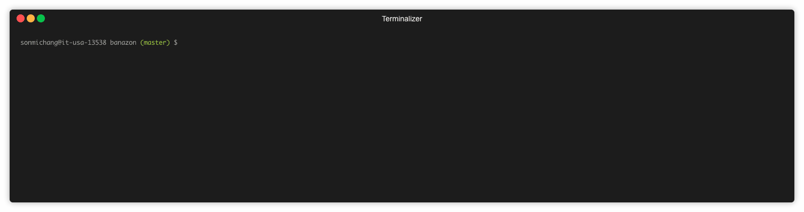
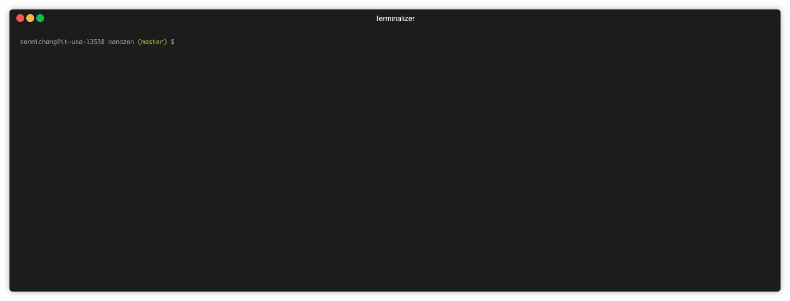

# banazon

> Bamazon is a command line node app that manages product inventory. It provides command-line interfaces for customers and managers.

## Bamazon for customers
### Purchase product



## Bamazon for managers
List a set of menu options:

### View Products for Sale

### View Low Inventory

### Add to Inventory

### Add New Product


# How to Run
For the first time only: in MySQL Workbench, connect to `localhost`, port: `3306` and run `init.sql` and `dataInsert.sql` to initialize the database.

Then, in Bash, type:
```
node bamazonCustomer.js
node bamazonManager.js
```
